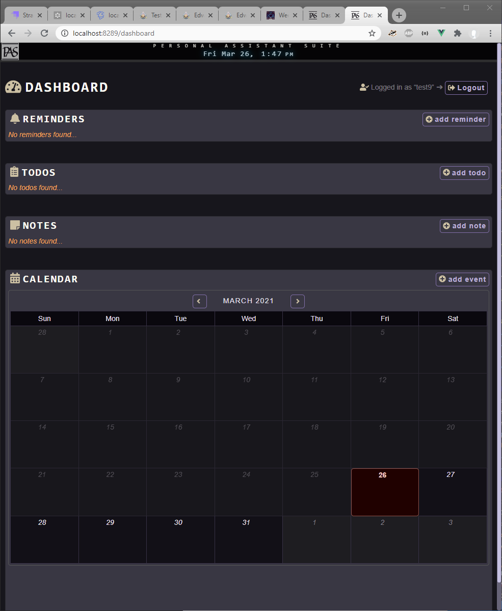
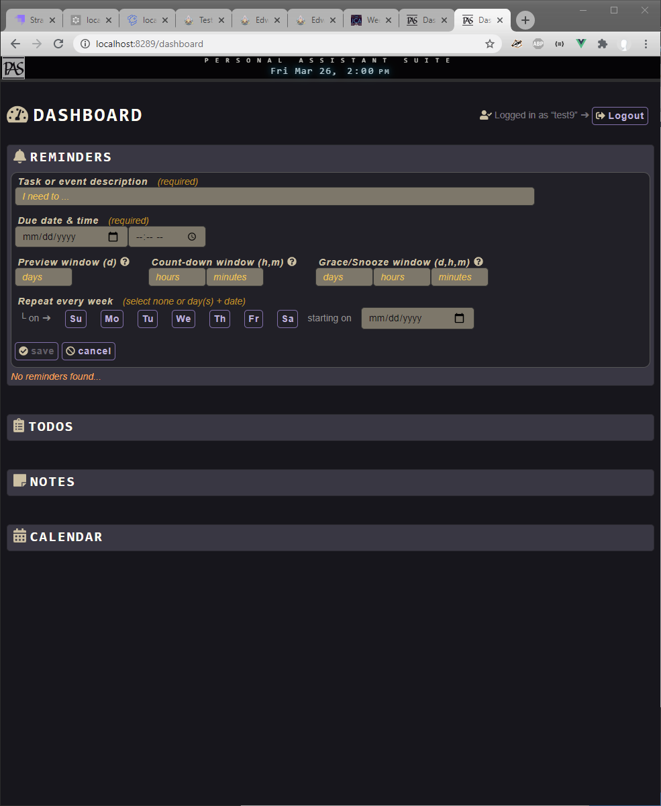
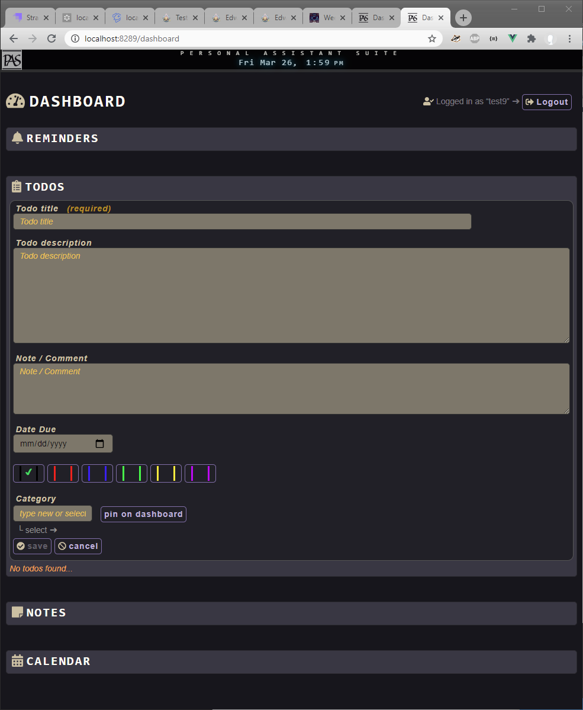
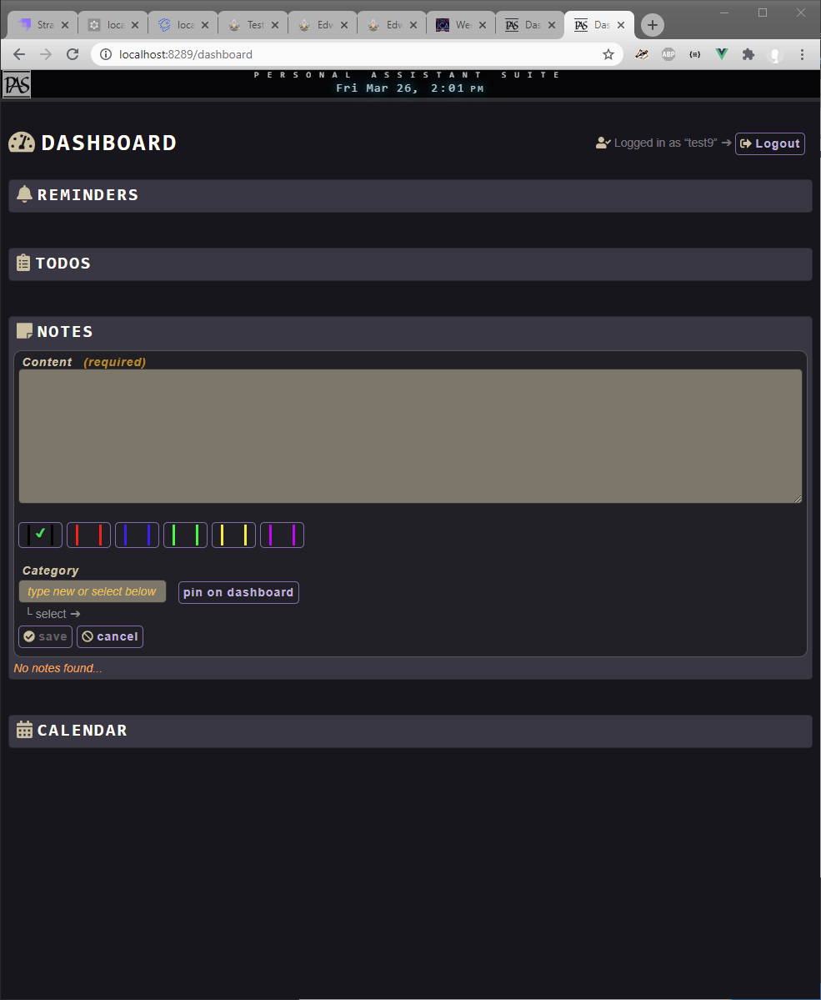
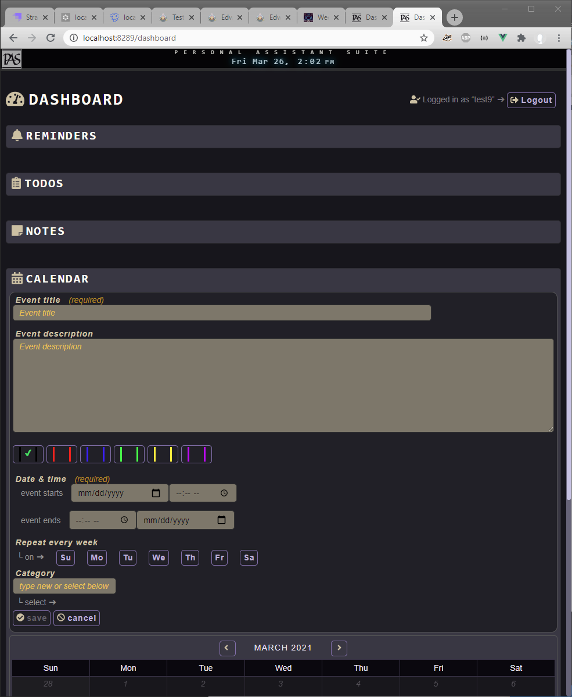
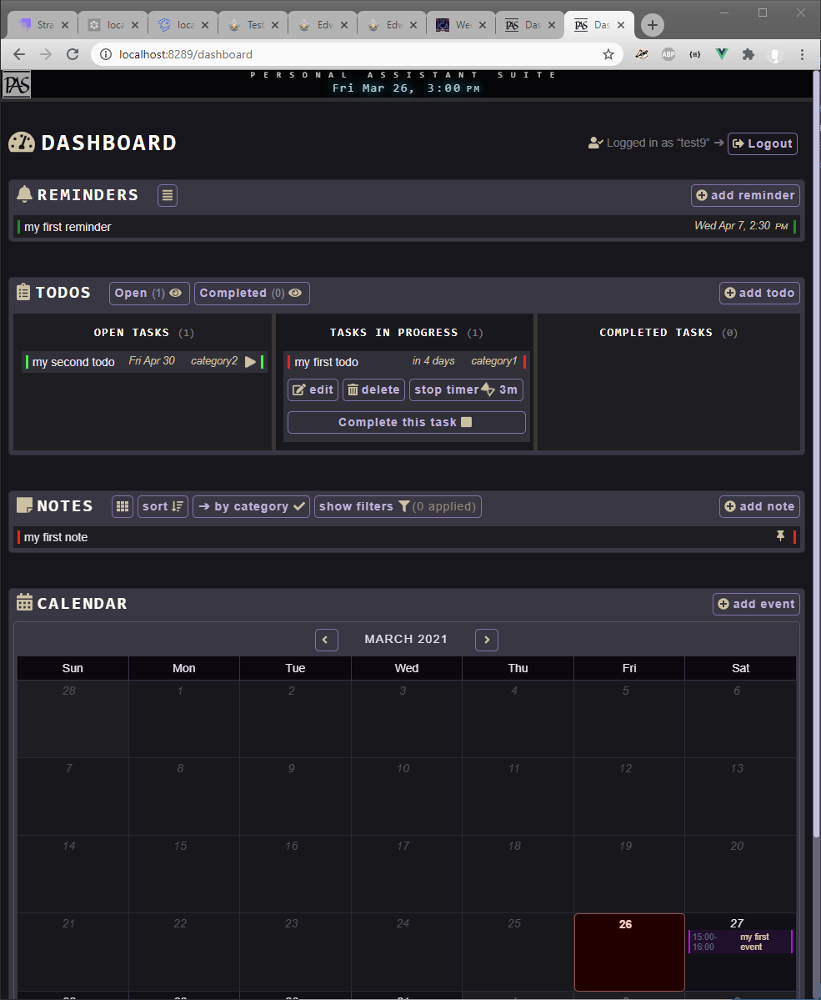
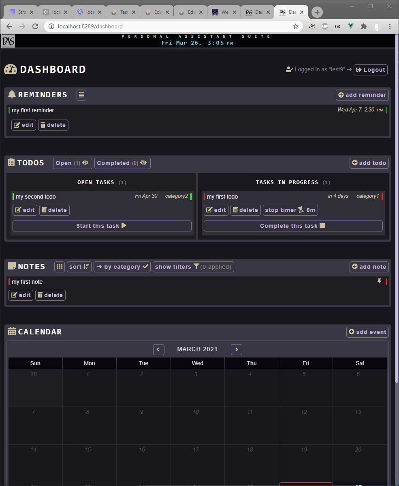
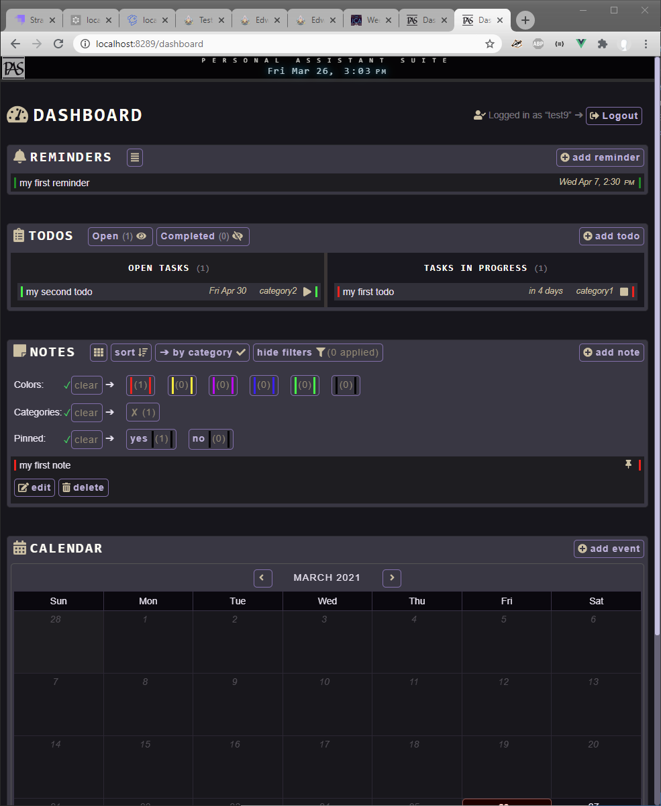

# vue-feathers-productivity-app

A productivity web-app (with ToDo, reminders, notes and a calendar of events) created with Vue, Feathers-Vuex, NeDB.

Intended to be run on a LAN on a dedicated server (desktop or laptop) it offers a web-app interface that is accessible to all other devices on the same network.



## Versions

- **_v0.1_**: _Authentication foundation_
  - can be used as starting point for any vue.js application requiring authentication.
  - uses feathers-vuex for authentication.
  - uses NeDB as database.
    - Sufficient for small scale applications - if need be can be swapped easily for MongoDB or other more robust DB solution.
- **_v0.2_**: _One Service: Notes_
  - extends v0.1.
  - uses feathers-vuex service to store notes.
  - logged in user can access own notes only.
  - implements create, read, edit, delete from server.
  - implements client-side sorting and filtering.
  - has several types of animation: vue-based as well as plain css.
  - changes in one browser are immediately reflected in another.
- **_v0.3_**: _Multiple Services_
  - extends v0.2.
  - adds Todos service.
  - adds Reminders service.
  - adds Events service.

## V0.3

### Features

- [x] **Authentication**
  - [x] functional registration page
    - [x] on success: redirect to login
      - [x] user is created in db
      - [x] display username
  - [x] functional login page
    - [x] on success: redirect to dashboard
  - [x] logout functionality
  - [x] basic dashboard page
    - [x] dashboard is not accessible when not logged in
      - [x] if not logged in: redirect to login
- [x] **Notes service**
  - [x] add Notes service
    - [x] enable server side
      - [x] generate feathers service
      - [x] add authentication hooks
    - [x] CRUD operations
      - [x] Create
      - [x] Read
      - [x] Update
      - [x] Delete
    - [x] redirects to login when session has expired
    - [x] display Create/Update error messages
    - [x] ask confirmation before Delete
    - [x] the logged-in user can access only their own notes
    - [x] when user logs out, their notes data are cleared from store
    - [x] changes in one browser are immediately reflected in another
    - [x] a note has text, category and color properties
      - [x] support basic markdown-style formatting of note text
      - [x] support color-coding
      - [x] support ordering by
        - [x] created time
        - [x] modified time
        - [x] category
        - [x] color
      - [x] support filtering by
        - [x] color
        - [x] category
        - [x] pinned on dashboard
    - [x] has list and grid mode
    - [x] implement pure css animations as well as vue-based transitions
- [ ] **Reminders service**
  - [ ] add Reminders service
    - [x] prepare server side
      - [x] generate feathers service
      - [x] add authentication hooks
    - [x] prepare client side
      - [x] add reminders service to the store
      - [x] add reminders service scaffold to the app
    - [x] CRUD operations
      - [x] Create
      - [x] Read
      - [x] Update
      - [x] Delete
    - [x] redirects to login when session has expired
    - [x] the logged-in user can access only their own reminders
    - [x] real-time update events are send only to the authenticated user
    - [x] when user logs out, their reminders data are cleared from store
    - [x] changes in one browser are immediately reflected in another
    - [x] reminder has text and due date & time properties
    - [x] reminder has window properties
      - [x] preview window (days)
      - [x] count-down window (hours & minutes)
      - [x] grace/snooze window (days, hours & minutes)
    - [ ] reminder has recurring scheduling properties
      - [x] start date of recurring schedule
      - [x] day of the week recurring
      - [ ] day of the month recurring
    - [x] reminder has countdown when end time is close
    - [x] a past-due notification for a recurring reminder can be dismissed
- [ ] **Events service**
  - [ ] add Events service
    - [x] prepare server side
      - [x] generate feathers service
      - [x] add authentication hooks
    - [x] prepare client side
      - [x] add events service to the store
      - [x] add events service scaffold to the app
    - [x] CRUD operations
      - [x] Create
      - [x] Read
      - [x] Update
      - [x] Delete
    - [x] redirects to login when session has expired
    - [x] events are integrated with the calendar
    - [ ] event can be associated with a reminder
    - [x] the logged-in user can access only their own events
    - [x] real-time update events are send only to the authenticated user
    - [x] when user logs out, their events data are cleared from store
    - [x] changes in one browser are immediately reflected in another
    - [x] event has title, description and start/end date & time properties
    - [x] event has color and category properties
    - [x] event has recurring scheduling properties
      - [x] start and end date of recurring schedule
      - [x] start and end time of recurring event
      - [x] day of the week recurring
- [ ] **Todos service**
  - [ ] add Todos service
    - [x] prepare server side
      - [x] generate feathers service
      - [x] add authentication hooks
    - [x] prepare client side
      - [x] add todos service to the store
      - [x] add todos service scaffold to the app
    - [x] CRUD operations
      - [x] Create
      - [x] Read
      - [x] Update
      - [x] Delete
    - [x] redirects to login when session has expired
    - [x] todos board has "open tasks", "tasks in progress" and "completed tasks" lanes
      - [x] "open tasks" and "completed tasks" lanes can be toggled between viewed and hidden states
    - [ ] todos with due date are shown on the calendar
    - [ ] todo can be associated with a reminder
    - [x] the logged-in user can access only their own todos
    - [x] real-time update events are send only to the authenticated user
    - [x] when user logs out, their todos data are cleared from store
    - [x] changes in one browser are immediately reflected in another
    - [x] todo has title, description, note, and due date properties
    - [x] todo has status property
    - [x] todo has color, category and pinned properties
    - [x] todo has elapsed-time property
      - [x] logged-in user can start/stop the timer (repeatable) to keep track of amount of time spend on task
- [ ] **services**
  - [x] > Reminders service
  - [x] > ToDos service
  - [x] > Notes service
  - [ ] > Bookmarks service
  - [x] > Events service
  - [ ] > Diary service
  - [ ] > Archive service
  - [x] import vue-fontawesome icons
  - [ ] Each service has a dedicated view page.
  - [x] Each service has a summary view on the Dashboard page
    - [x] Dashboard page from top to bottom: Reminders, ToDos, Notes, Calendar
    - [ ] Dashboard page from top to bottom: Reminders, ToDos, Notes, Calendar, Bookmarks, Archive
    - [x] Reminders has small strip on top of Dashboard page with upcoming reminder
    - [x] Reminders has countdown when next reminder is close
    - [x] Notes applies filter to hide non-pinned items
  - [ ] Services can be archived
- [x] **calendar**
  - [x] shows all days in selected month
    - [x] can cycle through months
    - [x] can jump back to current month
  - [x] displays non-recurring reminders
  - [x] displays recurring reminders
  - [x] displays events
  - [x] displays recurring events
  - [x] can switch between month-view and day-view
- [ ] **progressive web app**
  - [ ] app is operational when offline
  - [ ] app syncs when back online
- [ ] **deployment**
  - [ ] app is deployed on "cloud" service
  - [x] app is deployed on dedicated LAN server (PC/Laptop)
  - [x] app is accessible on desktop and mobile device
- [ ] add "remain logged in" option to extend 1-day jwt expiration
- [x] Scales from large screen desktop to small screen mobile (but due to the amount of information per page, best to view on medium to large screen)

### Page flow

```pseudo
/
if logged in -> dashboard
else -> login

/dashboard
if logged in -> ok, stay
else -> login

/login
if authenticated -> dashboard

/register
if valid entry -> login
```

### Nice to have but not implemented

- [ ] Encrypt NeDB data items - each with user's key
- [ ] Progressive Web App
- [ ] Test suite
- [ ] CI
- [ ] Deployable to cloud
  - [ ] Static (pre-rendered) + Lambda functions?
  - [ ] Replace NeDB with MongoDB or similar
  - [ ] AWS? Netlify?
- [ ] to run server on mobile device using termux app?

NOTE: The ["pwa" branch](tree/pwa) contains the basics to turn this web-app into a Progressive Web App (PWA).

## Setup

If you do not yet have [NodeJs](https://nodejs.org/en/) installed, I suggest to install [nvm](https://github.com/nvm-sh/nvm), the NodeJs Version Manager, and use that to install NodeJs V9.0.0 or later (I have this project running on an old eeepc netbook with [Linux Lite 3.8](https://osdn.net/projects/linuxlite/storage/3.8/), the last 32bit version. After much trial and error I installed Node V9.0.0 because that is the latest major version for which binaries are available)

Clone or download this repo - all required dependables are included. You only need NodeJs (with `npm`, the NodeJs Package Manager) to pre-exist on your system.

```bash
# cd to vue-feathers-productivity-app repo directory
$ cd [path/to/vue-feathers-productivity-app]
# install node_modules in server directory
$ cd server
$ npm install
# install node_modules in client directory
$ cd ../client
$ npm install
```

## Development Usage

**In Git Bash window #1 - run server**:

```bash
# cd to vue-feathers-productivity-app repo directory
$ cd [path/to/vue-feathers-productivity-app]
$ cd server
# copy dummy data as a starting point
# 4 users: test1, test2, test3 and test4. Password equals username
$ npm run setup:dev
# start the server
$ npm run dev
```

You should see a generic Feathers page at <http://localhost:3030/>.

**In Git Bash window #2 - run client**:

```bash
# cd to vue-feathers-productivity-app repo directory
$ cd [path/to/vue-feathers-productivity-app]
$ cd client
# start the server (hot-reload enabled)
$ npm run dev
```

You can view the client app at <http://localhost:8289/> (local) or at a LAN address (LAN network) - the build output will show the LAN IP address to use.

## "Production" Usage

This app is meant for local use, it's not designed to be able to handle a large user base. Besides, content is stored in simple clear text format only.

This app is meant to run on your LAN on one PC/laptop and you can then access the browser interface from any of your other devices when on the same network.

When used like this, you no longer need to run the server and client in "dev" mode. Instead of

```bash
# in the command windows for client and server
npm run dev
```

you can now build the client code with

```bash
# in the command window for the client
npm run build
```

and start both server and client with

```bash
# in the command windows for client and server
npm start
```

## Dependencies

**_Client Dependencies:_**

- @feathersjs/authentication-client
- @feathersjs/feathers
- @feathersjs/socketio-client
- @fortawesome/fontawesome-svg-core
- @fortawesome/free-regular-svg-icons
- @fortawesome/free-solid-svg-icons
- @fortawesome/vue-fontawesome
- feathers-vuex
- register-service-worker
- serve
- socket.io-client
- vue
- vue-router
- vuex

**_Server Dependencies:_**

- @feathersjs/authentication
- @feathersjs/authentication-jwt
- @feathersjs/authentication-local
- @feathersjs/configuration
- @feathersjs/errors
- @feathersjs/express
- @feathersjs/feathers
- @feathersjs/socketio
- compression
- cors
- feathers-authentication-hooks
- feathers-nedb
- helmet
- nedb
- serve-favicon
- winston

## Screenshot - Add Reminder



## Screenshot - Add ToDo



## Screenshot - Add Note



## Screenshot - Add Calendar Event



## Screenshot - Sample content



## Screenshot - Sample content expanded



## Screenshot - Notes filter


